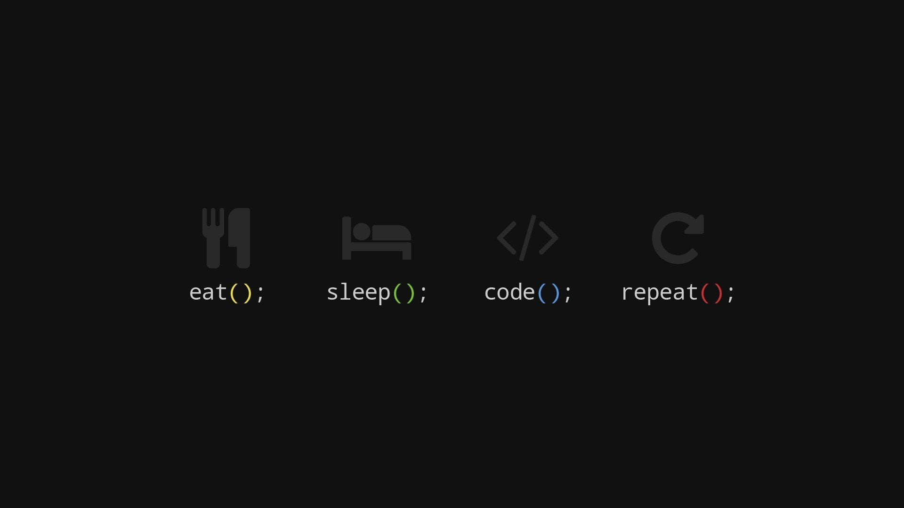

# Cours-Markdown
- Bonjour ceci est une petit typs de révition en markdown.
___

### Tous d'abord mettre des mots en gras: On utilise `**m**` ou `__M__`
ex: **M**   

### Pour mettre un texte en italique `_italique_` ou `*italique*`
ex: _italique_

### Enfin on peut les fusionner `***Italique en gras***` ou `___Italique en gras___`
ex: ***Italique en gras***
___
### Pour faire un tableau on utilise `| :- | :- |` pour le mettre à gauche, `| :--: | :--: |` pour le mettre au centre, `| -: | -: |` pour le mettre à droite.
ex:
| Le premier | second | troisième |  
| :--------- | :----- | :-------- |  
| le premier | second | troisième |  
| le premier | second | troisième |     
___
### Pour une petite liste à point on utilies `-`    
ex: 
- un 
- deux 
- trois
### on peut faire aussi une liste numéroté `1.`
ex:
1. un 
2. deux 
3. trois
___ 
### Pour mettre un liens on peut utiliser `[Lien](votre lien)`
ex: [Lien](https://github.com/Laborde-Guillemin) ver mon profil.  

### Ainsi on peut aussi mettre des images ``

ex: 
___
